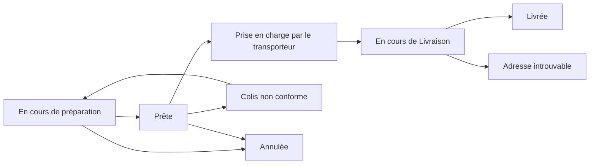

# Workflow Commande

### Diagramme du workflow

```mermaid
    graph LR
        A["En cours de préparation"]-->B["Prête"]
        B["Prête"]-->C["Prise en charge par le transporteur"];
        B["Prête"]-->H["Colis non conforme"];
        H["Colis non conforme"]-->A["En cours de préparation"]
        C["Prise en charge par le transporteur"]-->D["En cours de Livraison"];
        A["En cours de préparation"]-->E["Annulée"];
        B["Prête"]-->E["Annulée"];
        D["En cours de Livraison"]-->F["Livrée"];
        D["En cours de Livraison"]-->G["Adresse introuvable"];
        
```

## Composantes du projet

### Objet Commande

- updatedAt - Date
- numero - int
- adresse - Integer
- Status - String -> receptacle du workflow

